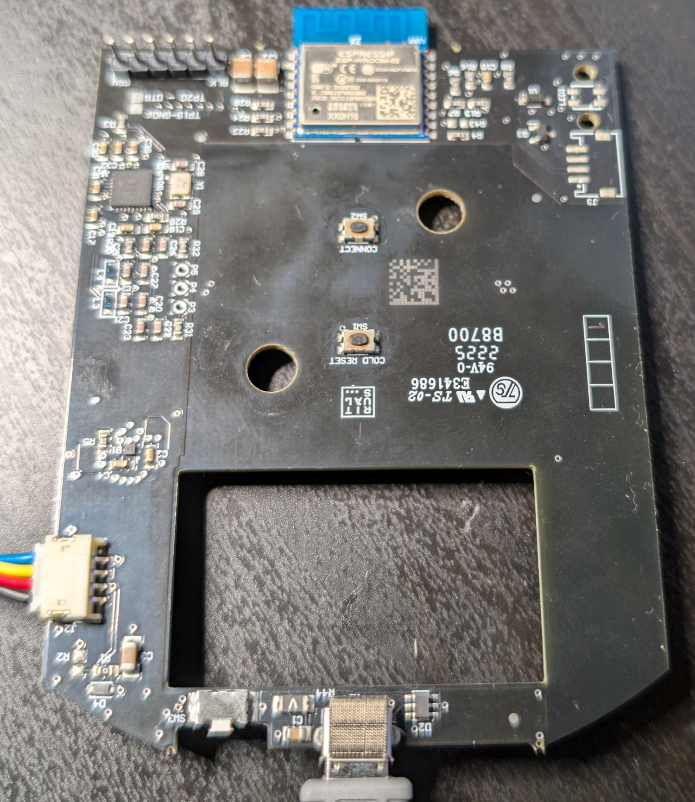
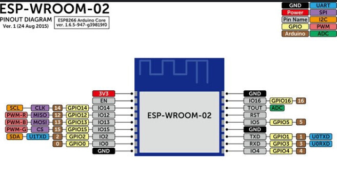
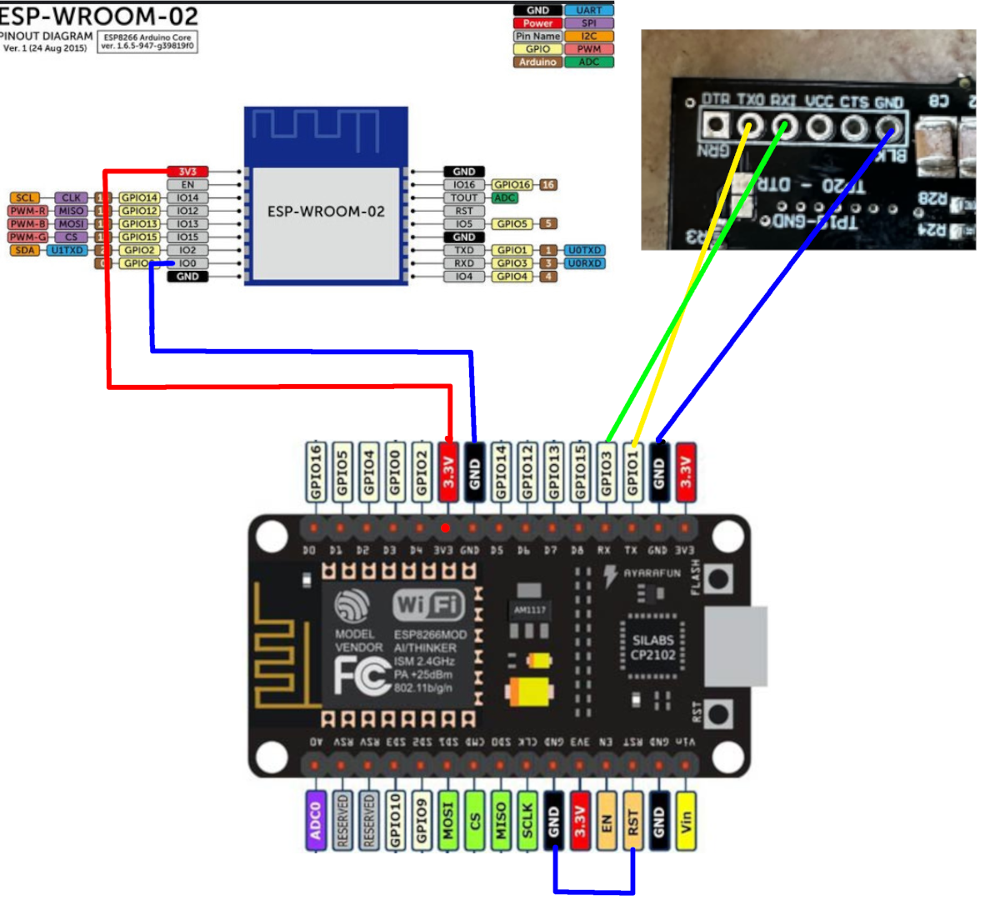

# This is my guide to get Perfume Genie 2.0 to work in ESPhome.

My Perfume Genie is know connected through ESPhome,
and i control fan speed. 
The LED light up blue when connected,red if disconnects. 
LED lights up green when fan is running. 
The rear button toggels the fan. 
I've set up timers in Nodered for runtimes,that can easily be done with HA automations to. 

I'm waiting for som parts, but plan to add a capacitive touch sensor to it,  
so you just can activate it with touching/rubbing the genie, so it becomes a real genie :D  

# Here is som info on the perfume genie board. 
The pins on the header in the top left corner i soldered on my self to make flashing easier.

 

Pins:
- IO4 is for PWM to fan(Blue wire).
- IO15 is for LED (WS2812).
- IO16 is for the Connect button.
- IO3 is for the button at the rear.

There is a NFC NXP RC522 for the scent name of the tank. 
I haven't figured out how it's connected to the ESP yet. 
But i also guess it's not so easy to figure out the data for the tank tag to get it working. 
If someone is good at that, let my know.

# Flashing:

For Software i just used ESPhome addon in HA to compile the bin file,  
and used https://web.esphome.io/?dashboard_install for flashing that file.  

Used these two pages for some info about wiring it up: 
https://tasmota.github.io/docs/Getting-Started/#prerequisites  
https://esphome.io/guides/physical_device_connection.html#unpopulated-programming-header  

I used a NodeMCU board as serial adapter.  
Connected the reset pin to ground on the Nodemcu to disable the onboard ESP.  
I used the pin header i added to the genie board as mentioned earlier to connect the tx,rx and ground.  
For the 3volt and io0 directly to the genie esp, i just manualy hold the wires in place, worked fine.  

Just make sure you use 3 volt on whatever serial adapter you use.(i read somwhere)

