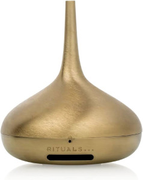

# This is my guide to get Perfume Genie 2.0 to work in ESPhome.

My Perfume Genie is know connected through ESPhome,
and i control fan speed. 
The LED light up blue when connected,red if disconnects. 
LED lights up green when fan is running. 
The rear button toggels the fan. 
I've set up timers in Nodered for run time,that can easily be done with HA automations to. 

Here is som info on the perfume genie board. 

